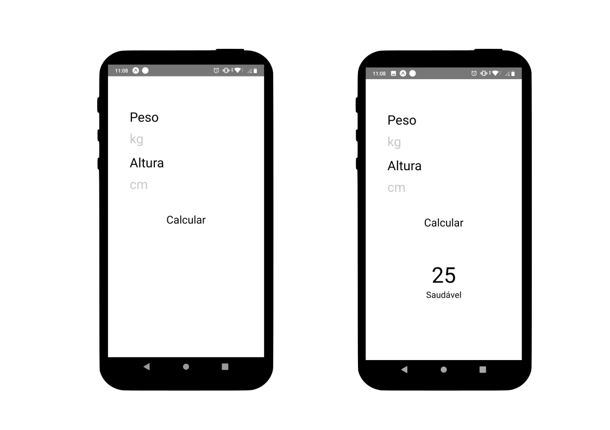

<h3 align="center">
  :muscle: IMC APP - v1
</h3>

<p align="center">
  
</p>

----

### Tecnologias utilizadas

* [Expo](https://expo.io/)
* [React Native](https://reactnative.dev/)


----
## Como rodar o projeto

1. Instalar o node
```bash
# Usando arch linux
pacman -S nodejs npm

# Usando Ubuntu
curl -sL https://deb.nodesource.com/setup_12.x | sudo -E bash -
sudo apt-get install -y nodejs

# Usando debian (Tem que estar como root)
curl -sL https://deb.nodesource.com/setup_12.x | bash -
apt-get install -y nodejs
```

2. Instalar o expo-cli
```bash
# Com npm
npm install expo-cli --global
```

3. Instalar as depedencias do projeto
```bash
# Com npm
npm install
```

4. Rodar o projeto!!
```bash
# Com npm
npm start
```
---
<p align="center">
  Feito com :heart: por Daniel Ribeiro
</p>